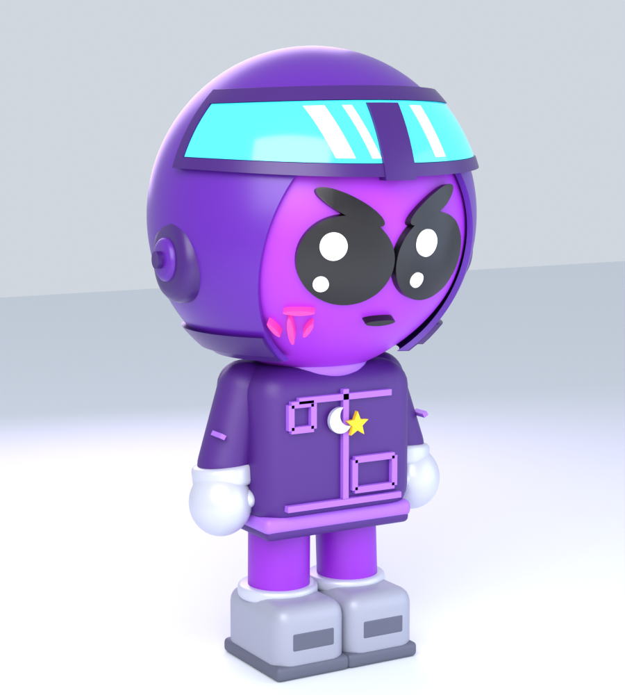
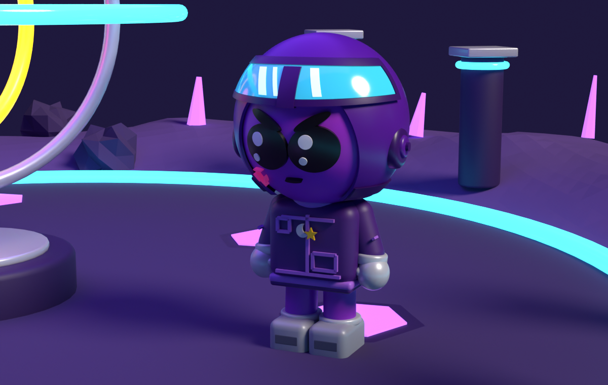
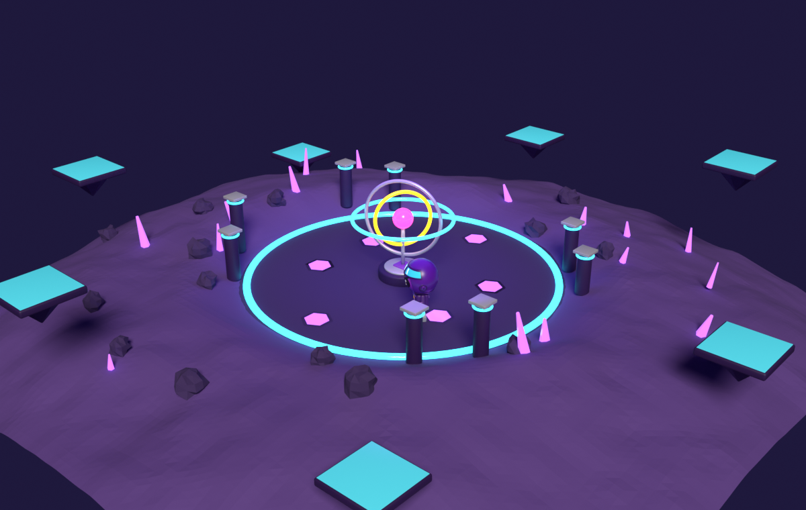

# blender-forge — skill de modelado procedural para Claude Code

> *A Claude Code skill + Python library to build 3D characters, maps and worlds in Blender
> from code, headless, and iterate on them in minutes.*

Modelar a mano en Blender es lento y no se puede iterar. Aquí **el script ES el modelo**:
escribes un `.py`, ejecutas Blender headless, **miras el render** y ajustas números.
La librería `bforge` trae ya resuelto lo que siempre cuesta: detalles pegados a superficies
curvas, cáscaras, aperturas, terreno, mapas, iluminación y fichas de vistas.

<p align="center">
  
  
  
</p>

## Instalación

```bash
git clone https://github.com/dfadify-web/blender-forge.git ~/.claude/skills/blender
```

En Windows:
```powershell
git clone https://github.com/dfadify-web/blender-forge.git "$env:USERPROFILE\.claude\skills\blender"
```

Claude Code la detecta sola. Invocación: `/blender <qué modelar>`.
Sin Claude Code también sirve: es una librería Python normal para `bpy`.

Requisitos: **Blender 4.x** (probado en 4.4). Nada más — sin addons ni dependencias.

## Uso en 30 segundos

```python
import sys, os
for _p in (os.environ.get("BFORGE_LIB"),
           os.path.expanduser("~/.claude/skills/blender/lib")):
    if _p and os.path.isdir(_p):
        sys.path.insert(0, _p); break
from bforge import *

clear()
P = palette(piel="#A32BD4", casco="#59189B", negro="#0C0910")

b = Ball(center=(0, 0, 2.7), r=0.95, squash=(1, 0.94, 1))
b.skin("Cabeza", P['piel'], taper=0.11)
for s in (-1, 1):
    b.patch("Ojo_%d" % s, s*0.278, -0.195, 0.284, 0.256, P['negro'], roll=M(s*9))
casco = b.shell("Casco", 1.055, 1.018, P['casco'])
cut(casco, b.cone_cutter(dz=-0.32, hax=45, haz=52))   # abre la cara
b.done()

setup_render(); studio(); cam = camera()
finish_scene("cabeza", os.path.expanduser("~/Desktop/prueba"), cam)
```

```bash
blender -b --factory-startup --python mi_script.py
```

## Qué trae

| | |
|---|---|
| **Primitivas** | `sphere box cyl cone torus plane capsule star poly_prism text3d` |
| **Booleanas** | `cut inter union join` (solver EXACT, sin sorpresas) |
| **Modificadores** | `bevel subsurf solidify decimate array mirror_x` |
| **Superficies curvas** | clase `Ball`: `patch` (detalle conformado), `shell`, `band`, `cone_cutter`, `ellip_cyl`, squash automático |
| **Mundos** | `terrain` (fBm + isla), `flatten_disc`, `sample_terrain`, `tilemap` ASCII, `scatter`, `radial`, `water` |
| **Assets** | `tree rock crystal platform building road fence` |
| **Render** | `setup_render`, `studio` (3 puntos), `outdoor` (sol+cielo), `shot`, `sheet` (4 vistas), `orbit` |
| **Salida** | `finish_scene` (.blend + renders + .glb), `append_blend`, `quick_rig` |

### La clase `Ball`

El truco central. Todo se construye sobre una **esfera perfecta** y el aplastado se aplica
al final con un empty padre, así ningún detalle flota ni se hunde:

```python
b.patch("Ceja_L", -0.265, 0.098, 0.218, 0.056, NEGRO, k=1.047, roll=M(-27))
```
`patch` = esfera(k) ∩ cilindro elíptico apuntando al centro → el detalle queda **pegado** a
la curvatura. Sirve para ojos, cejas, marcas, ventanas de una cúpula o cráteres de un planeta.

### Mapas con dibujos ASCII

```python
MAPA = [".#..x..#.",
        "#.......#",
        "..x.c.x..",
        "#.......#",
        ".#..x..#."]
tilemap(MAPA, {'#': pilar, 'x': placa, 'c': caja}, tile=2.4)
```
Cada símbolo es una función `(x, y, z, i, j) -> objeto(s)`. Rediseñar un nivel = reescribir
el string.

## Variables de entorno

| var | por defecto | para qué |
|---|---|---|
| `BF_SAMPLES` | 64 | muestras de Cycles (48 para iterar, 128 para el final) |
| `BF_VIEWS` | front,34 | `front,34,side,back,orbit,none` |
| `BF_RES` | 900x1000 | resolución |
| `BF_ENGINE` | CYCLES | `CYCLES` o `EEVEE` |
| `BF_GLB` / `BF_BLEND` | 1 | exportar / guardar |
| `BFORGE_LIB` | — | ruta a `lib/` si la instalas en otro sitio |

## Plantillas

- `templates/character.py` — chibi completo (cabeza + cara + casco + cuerpo + ficha de 4 vistas).
- `templates/world.py` — terreno + tilemap + scatter de props + cámara aérea.

Cópialas al directorio del proyecto y edita solo las constantes de arriba.

## Lo importante: el flujo

1. Medir la referencia en fracciones (cabeza = 49% del total, ojo = 27% del ancho de cabeza…).
2. Escribir **un** script con esas medidas como constantes.
3. Render rápido: `BF_SAMPLES=48 BF_VIEWS=front,34`.
4. **Mirar el PNG.** Comparar silueta → volúmenes → detalles → color.
5. Corregir 3-5 cosas por pasada. Repetir.
6. Pasada final a 128 muestras + `.glb`.

`SKILL.md` incluye además **los 8 errores que se cometen siempre** al modelar por código
(coordenadas locales vs mundo, detalles duplicados en la nuca, cortar un casco con cilindro
en vez de cono, bandas que parecen viseras de gorra…). Están ahí porque los cometí todos.

## Licencia

MIT
